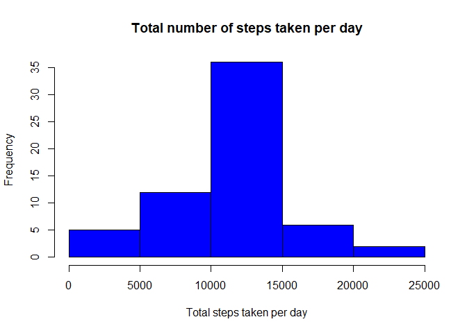
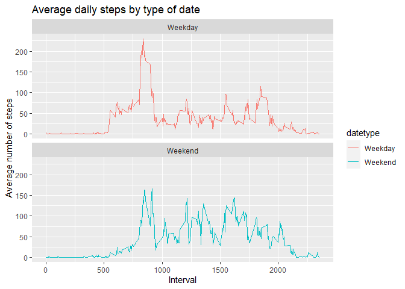

## Loading and preprocessing the data
The first step is to load our library in this case ggplot2, next we check if
our zip file was decompress in our current working directory, if not we unzip 
the file and we assign it to our variable call **activity** and finally we 
convert the column date in a date variable


```r
library(ggplot2)

rfilename <- "activity.zip"


# Checking if file exists
if (!file.exists("activity.cvs")) { 
  unzip(rfilename) 
}

activity <- read.csv("activity.csv")

activity$date <- as.Date(activity$date, format = "%Y-%m-%d")
```

## What is mean total number of steps taken per day?
for this part, first we Calculate the total number of steps taken per day, 
ignoring the missing values

```r
stepsdaily <- aggregate(steps~date,activity,sum, na.rm=TRUE)
```

next we plot a histogram of the total number of steps taken each day

```r
hist(stepsdaily$steps, main = "Total number of steps taken per day",
     xlab = "Total steps taken per day", col = "blue")
```

<!-- -->

finally we calculate Mean and median of total number of steps taken per day

```r
mean(stepsdaily$steps)
```

```
## [1] 10766.19
```

```r
median(stepsdaily$steps)
```

```
## [1] 10765
```


## What is the average daily activity pattern?
First, Time series plot of the 5 minute interval (x) and averaged number of 
steps taken averaged across all days (y)

```r
stepsinterval <- aggregate(steps~interval,activity,mean, na.rm=TRUE)

plot(steps~interval, data=stepsinterval, type="l",col = "red", 
     main = "Average steps per time interval" )
```

<!-- -->

Second, 5-minute interval (on average across all the days) with the maximum number of steps

```r
stepsinterval[which.max(stepsinterval$steps),]$interval
```

```
## [1] 835
```


## Imputing missing values
First we calculate the total number of missing values

```r
sum(is.na(activity$steps))
```

```
## [1] 2304
```

Next we replace the missing values with the mean of that 5-minute interval,
after that we create a new dataset call **activityfull**  that is equal to the original dataset 
but with the missing data filled in.

```r
activity$fullsteps <- ifelse(is.na(activity$steps), 
                             round(stepsinterval$steps[match(activity$interval, stepsinterval$interval)],0),
                             activity$steps)

activityfull <- data.frame(steps=activity$fullsteps, interval=activity$interval, date=activity$date)
```
Now, we make a histogram of the total number of steps taken each day 

```r
stepsdailyfull <- aggregate(steps~date,activityfull,sum, na.rm=TRUE)
hist(stepsdailyfull$steps, main = "Total number of steps taken per day",
     xlab = "Total steps taken per day", col = "blue")
```

<!-- -->

and finally we calculate the Mean and the Median of our new dataset

```r
mean(stepsdailyfull$steps)
```

```
## [1] 10765.64
```

```r
median(stepsdailyfull$steps)
```

```
## [1] 10762
```
Imputing missing data have only a little impact on the mean ant the median of the total daily number of steps.
also if we observe the two graphics they are almost identical


## Are there differences in activity patterns between weekdays and weekends?
First we Create a new factor variable in **activityfull** with two levels – “weekday” and “weekend” indicating whether a given date is a weekday or weekend day.

```r
activityfull$datetype <- sapply(activityfull$date, function(x) {
  if (weekdays(x) == "sábado" | weekdays(x) =="domingo") 
  {y <- "Weekend"} else 
  {y <- "Weekday"}
  y
})
```

next we make a panel plot containing a time series plot of the 5-minute interval  and the average number of steps taken, averaged across all weekday days or weekend days.

```r
stepsintervalfull <- aggregate(steps~interval+datetype,data=activityfull,FUN=mean)

g <-  ggplot(stepsintervalfull, aes(x = interval , y = steps, color = datetype)) +
  geom_line() +
  labs(title = "Average daily steps by type of date", x = "Interval", y = "Average number of steps") +
  facet_wrap(~datetype, ncol = 1, nrow=2)
print(g)
```

<!-- -->
