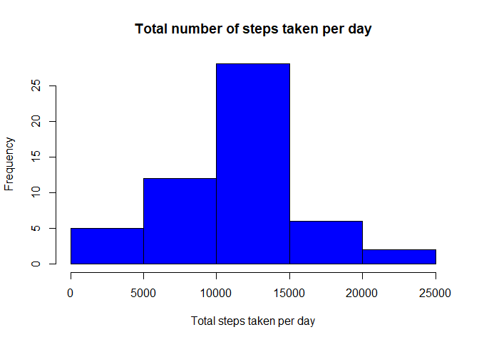
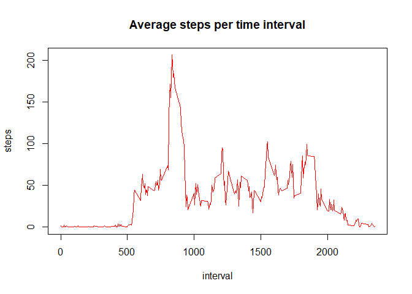

## Loading and preprocessing the data
The first step is to load our library in this case ggplot2, next we check if
our zip file was decompress in our current working directory, if not we unzip 
the file and we assign it to our variable call **activity** and finally we 
convert the column date in a date variable


```r
library(ggplot2)

rfilename <- "activity.zip"


# Checking if file exists
if (!file.exists("activity.cvs")) { 
  unzip(rfilename) 
}

activity <- read.csv("activity.csv")

activity$date <- as.Date(activity$date, format = "%Y-%m-%d")
```

## What is mean total number of steps taken per day?
for this part, first we Calculate the total number of steps taken per day, 
ignoring the missing values

```r
stepsdaily <- aggregate(steps~date,activity,sum, na.rm=TRUE)
```

next we plot a histogram of the total number of steps taken each day

```r
hist(stepsdaily$steps, main = "Total number of steps taken per day",
     xlab = "Total steps taken per day", col = "blue")
```

<!-- -->

finally we calculate Mean and median of total number of steps taken per day

```r
mean(stepsdaily$steps)
```

```
## [1] 10766.19
```

```r
median(stepsdaily$steps)
```

```
## [1] 10765
```


## What is the average daily activity pattern?
First, Time series plot of the 5 minute interval (x) and averaged number of 
steps taken averaged across all days (y)

```r
stepsinterval <- aggregate(steps~interval,activity,mean, na.rm=TRUE)

plot(steps~interval, data=stepsinterval, type="l",col = "red", 
     main = "Average steps per time interval" )
```

<!-- -->

Second, 5-minute interval (on average across all the days) with the maximum number of steps

```r
stepsinterval[which.max(stepsinterval$steps),]$interval
```

```
## [1] 835
```


## Imputing missing values


## Are there differences in activity patterns between weekdays and weekends?
